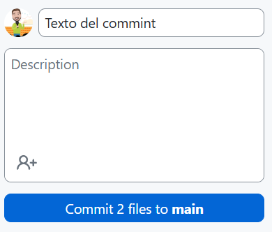
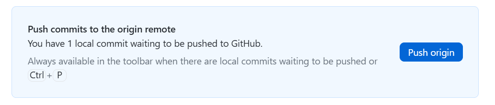

# Práctica 2.0 Trabajo con repositorios en GitHub y documentación en Markdown

El objetivo de esta práctica es familiarizarte con GitHub Classroom, Git/GitHub Desktop y GitHub CLI, y aprender a documentar proyectos usando el lenguaje Markdown.

## Parte 1 Instalación de herramientas de trabajo

Antes de comenzar, asegúrate de tener instalado lo siguiente en tu equipo:  

- [GitHub Desktop](https://desktop.github.com/)  
- [GitHub CLI](https://cli.github.com/)  
- [Git](https://git-scm.com/)  


## Parte 2: Acceso a GitHub Classroom

1. Accede a tu cuenta de *GitHub Classroom* y acepta la tarea que se te ha asignado desde el enlace de **Teams** de la tarea de clase.
2. Se generará un repositorio personal para ti en GitHub.

## Parte 3: Clonado del repositorio

Clona el repositorio en tu ordenador usando una de estas opciones:

- Con **GitHub Desktop**:
Al hacer clic en el enlace de Teams haz clic en *Clone a repository*.

- Con **GitHub CLI**:
Usa el comando:

```bash
gh repo clone javiertraseira/practica2-0-DI
```

## Parte 4: Creación de documentación en formato Markdown

1. Dentro del repositorio clonado, crea un archivo llamado *README.md*

2. Ese archivo servirá como **documentación** de un proyecto ficticio y deberá para ello utilizar los principales elementos del lenguaje Markdown.

### Requerimientos formales

El archivo debe contener varios apartados en los que se incluyan los elementos que permite el lenguaje; texto formateado, una lista, una tabla, imágenes, enlaces y un bloque de código de código de instalación, como en las capturas mostradas a continuación

El `README.md` debe incluir:  

- **Título principal** del proyecto  
- **Títulos secundarios** (ej.: Descripción, Instalación, Uso, Características, etc.)  
- **Lista de tareas pendientes** (checklist con `- [ ]`)  
- **Tabla** con al menos 2 columnas y 2 filas  
- **Imagen** insertada  
- **Bloque de código** con formato (ej.: instrucciones de instalación)  
- **Enlace externo** a una web  


## Parte 5: Subida y control de versiones  

1. **Guarda los cambios** de tu archivo `README.md`.  
2. **Haz un commit** con un mensaje que describa los avances:  

- En **Github Desktop**:



- En **GitHub CLI**:
```bash
git add README.md
git commit -m "Añadido README inicial con estructura en Markdown"
```  

3. **Sube los cambios al repositorio remoto**:  

- En **Github Desktop**:



- En **GitHub CLI**:
```bash
git push origin main
```  


4. **Investiga cómo revertir** uno de los commits que hayas subido al repositorio (`main`).  
   - Ejemplo con Git:  
     ```bash
     git revert <id-del-commit>
     ```  

5. **Clona el repositorio en otro equipo** (por ejemplo, en casa y en clase) y practica cómo **mantener sincronizados ambos repositorios** usando:  

```bash
git pull origin main
```  


