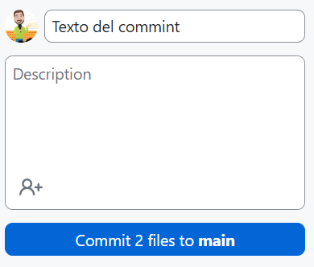

# Práctica 2.0 Trabajo con repositorios en GitHub y documentación en Markdown

El objetivo de esta práctica es familiarizarte con el entorno de trabajo (*github, Classroom50, ficheros markdown*) que utilizaremos durante el curso para gestionar las prácticas de la asignatura.

## Parte 1 Instalación de herramientas de trabajo

Antes de comenzar, asegúrate de tener instalado lo siguiente en tu equipo:  

- [GitHub Desktop](https://desktop.github.com/)  
- [GitHub CLI](https://cli.github.com/)  
- [Git](https://git-scm.com/)  

También necesitarás disponer de una cuenta de GitHub y estar correctamente identificado en Classroom 50.


## Parte 2: Acceso a Classroom 50

1. Accede al enlace de la tarea proporcionado por el profesor en Teams.

2. Inicia sesión utilizando tu cuenta de GitHub si fuera necesario.

3. Acepta la tarea.

Classroom 50 creará automáticamente un **repositorio privado para ti** a partir del repositorio plantilla preparado por el profesor.

> **Importante:** debes trabajar siempre sobre el repositorio que Classroom 50 ha creado para ti. No debes clonar directamente el repositorio plantilla del profesor.

4. Accede desde Classroom 50 al repositorio que se ha creado para ti.

5. Comprueba que el repositorio contiene, al menos, este archivo `README.md`.

## Parte 3: Clonado del repositorio

Ahora vas a clonar, es decir, descargar una copia de **tu repositorio personal** en el ordenador.

### Opción A – GitHub Desktop

1. Accede en GitHub al repositorio que Classroom 50 ha creado para ti.
2. Pulsa **Code**.
3. Selecciona **Open with GitHub Desktop**.
4. Selecciona la carpeta de tu ordenador en la que quieres guardar el proyecto.
5. Pulsa **Clone**.

Comprueba que el repositorio aparece correctamente en GitHub Desktop.

### Opción B – GitHub CLI

También practicaremos el acceso a GitHub mediante la línea de comandos.

Primero autentícate:

```bash
gh auth login
```

> Te preguntará el método de autenticación, puedes seleccionar el navegador web e introducir tus credenciales.

- Después, desde **tu repositorio personal en GitHub**, pulsa:

**Code → Local → GitHub CLI**

GitHub te mostrará un comando similar a:

```bash
gh repo clone dam-di-26-27/practica2-0-DI
```

Copia y ejecuta **el comando correspondiente a tu repositorio**.

> No utilices `gh repo clone javiertraseira/practica2-0-DI`. Ese es el repositorio plantilla del profesor y no tu repositorio de trabajo.


## Parte 4: Creación de documentación en formato Markdown

En el repositorio encontrarás este archivo `README.md`, que contiene el enunciado de la práctica.

**No debes sustituir ni eliminar este archivo.**

Crea en la raíz del repositorio un nuevo archivo llamado:

```text
DOCUMENTACION.md
```

Este archivo representará la documentación de un proyecto ficticio desarrollado por ti.

Puedes elegir libremente el tipo de aplicación: una aplicación de gestión, una aplicación móvil, un videojuego, una herramienta educativa, etc.

### Contenido mínimo

El archivo `DOCUMENTACION.md` deberá utilizar correctamente Markdown e incluir, como mínimo:

- Un título principal.
- Varios títulos y subtítulos.
- Una breve descripción del proyecto.
- Texto en **negrita** y *cursiva*.
- Una lista ordenada.
- Una lista no ordenada.
- Una lista de tareas mediante checkboxes (`- [ ]` y `- [x]`).
- Una tabla con al menos 2 columnas y 2 filas de datos.
- Una imagen.
- Un enlace a una página web externa.
- Código escrito en línea.
- Un bloque de código con formato.

Por ejemplo, puedes incluir un apartado de instalación:

```bash
git clone https://github.com/usuario/proyecto.git
cd proyecto
```

Organiza el documento para que pueda entenderse fácilmente. No se trata únicamente de utilizar la sintaxis Markdown solicitada, sino de crear una documentación clara y coherente.


## Parte 5: Subida (commit) y control de versiones  

1. **Guarda los cambios** de tu archivo `DOCUMENTACION.md`.  
2. Deberás **Hacer un commit** con un mensaje que describa los avances:  

### Mediante GitHub Desktop

1. Abre GitHub Desktop.
2. Comprueba los cambios realizados.
3. Escribe un mensaje de commit descriptivo, por ejemplo:

```text
Añadida documentación inicial del proyecto
```
4. Realiza el commit.
5. Utiliza **Push origin** para enviar los cambios a GitHub.



### Desde GitHub CLI

También puedes realizar las mismas operaciones desde la terminal:

```bash
git status
git add DOCUMENTACION.md
git commit -m "Añadida documentación inicial del proyecto"
git push origin main
```  

Comprueba qué información proporciona `git status` antes y después de realizar el commit.

## Parte 6 – Realizar un segundo cambio

Modifica ahora `DOCUMENTACION.md`.

Por ejemplo:

- añade una nueva característica de la aplicación;
- marca alguna tarea de la checklist como completada;
- añade una nueva fila a la tabla.

Realiza un segundo commit:

```bash
git add DOCUMENTACION.md
git commit -m "Actualizada documentación del proyecto"
git push origin main
```

Comprueba en GitHub que aparecen los diferentes commits realizados.

---

## Parte 7 – Revertir un commit

Vamos a practicar cómo deshacer un cambio que **ya ha sido registrado en Git**.

1. Realiza una modificación claramente identificable en `DOCUMENTACION.md`.

Por ejemplo, añade:

```markdown
## Sección temporal

Este contenido se eliminará posteriormente mediante git revert.
```

2. Realiza un commit y súbelo:

**Mediante GitHub Desktop:**

- Comprueba en **Changes** que aparece modificado `DOCUMENTACION.md`.
- Introduce el mensaje `Añadida sección temporal`.
- Pulsa **Commit to main**.
- Pulsa **Push origin**.

3. Consulta el historial:

```bash
git log --oneline
```

**Mediante Git:**

```bash
git add DOCUMENTACION.md
git commit -m "Añadida sección temporal"
git push origin main
```

3. Localizar el commit

Localiza el identificador del commit que acabas de realizar.

**Mediante GitHub Desktop:**

- Accede a **History**.
- Localiza el commit `Añadida sección temporal`.

**Mediante Git:**

```bash
git log --oneline
```

4. Revertir el commit

**Mediante GitHub Desktop:**

- Accede a **History**.
- Haz clic derecho sobre `Añadida sección temporal`.
- Selecciona **Revert Changes in Commit**.
- GitHub Desktop creará un nuevo commit que deshace los cambios.
- Pulsa **Push origin**.

**Mediante Git:**

```bash
git revert <id-del-commit>
git push origin main
```

5. Comprobar el resultado

Comprueba que:

- La sección temporal ha desaparecido de `DOCUMENTACION.md`.
- El commit original sigue apareciendo en el historial.
- Existe un nuevo commit que revierte el cambio.

Por ejemplo:

```text
c5d921a Revert "Añadida sección temporal"
a7f32c1 Añadida sección temporal
82d190a Añadida documentación inicial
```

> Observa que `git revert` **no elimina el commit anterior del historial**. En su lugar crea un nuevo commit que deshace sus cambios.

---

Si quieres continuar trabajando en el proyecto desde otro ordenador, como desde casa, puedes hacerlo utilizando el mismo repositorio de GitHub.

La primera vez que trabajes desde ese ordenador **clona** **tu repositorio personal** en el nuevo equipo, igual que hiciste anteriormente:
> Antes de empezar a trabajar en un proyecto desde otro ordenador, acostúmbrate a sincronizar primero el repositorio.

A partir de ese momento tendrás una copia local del mismo repositorio en ambos equipos.


---

## Parte 9 – Comprobación final

Antes de considerar terminada la práctica, comprueba que:

- Estás trabajando en el repositorio personal creado por Classroom 50.
- El archivo `README.md` original continúa en el repositorio.
- Has creado `DOCUMENTACION.md`.
- `DOCUMENTACION.md` contiene los elementos Markdown solicitados.
- Has realizado varios commits con mensajes descriptivos.
- Has enviado los commits al repositorio remoto mediante `push`.
- Has realizado correctamente un `git revert`.
- Has practicado la sincronización mediante `git pull`.
- Todos los cambios aparecen en tu repositorio de GitHub.

## Entrega

La entrega se realizará mediante el repositorio personal generado por Classroom 50.

Asegúrate de que **todos tus cambios y commits se encuentran en GitHub** antes de dar por finalizada la práctica.


